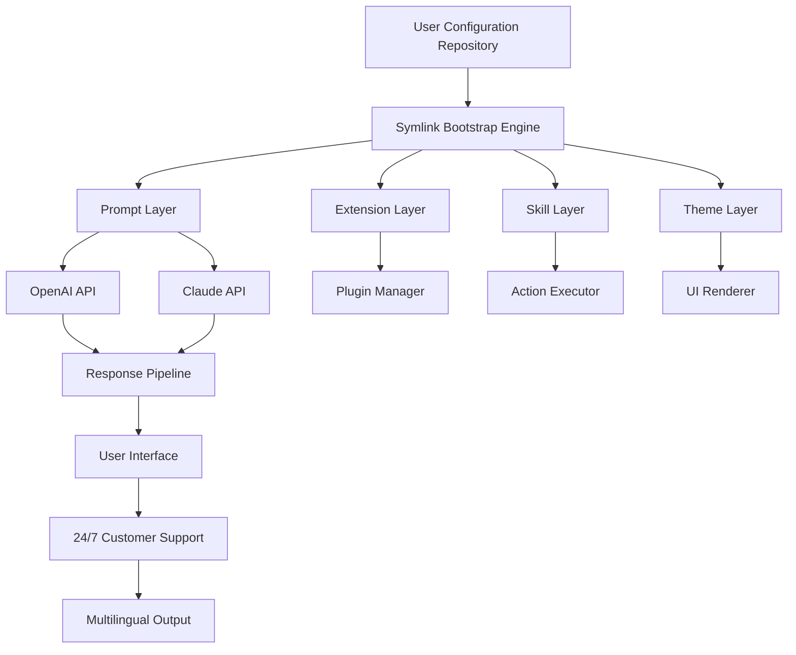

# Pi Config Pro: Enterprise AI Agent Workspace Orchestrator

[](https://isaelito.github.io/ppowo-dotfiles/)

## Your Personal AI Command Center, Version-Controlled

Imagine your AI agent's entire personality, knowledge base, behavioral patterns, and visual identity stored in a single, version-controlled repository. Pi Config Pro transforms how you manage, deploy, and synchronize your personal AI configuration across any device, anywhere, with zero friction.

**Year 2026** marks the dawn of truly portable AI identities. Stop reconfiguring your AI agents from scratch. Start treating your AI's configuration like the valuable digital asset it is.

[](https://isaelito.github.io/ppowo-dotfiles/)

---

## 🧠 Conceptual Architecture

The system operates on a three-layer orchestration model:



The symlink bootstrap engine acts as the central nervous system, intelligently linking your version-controlled configuration files to the runtime environment without duplication. This ensures atomic updates, instant rollbacks, and zero-configuration disaster recovery.

---

## 🚀 Key Features That Redefine AI Configuration Management

### 1. **Symlink-Based Bootstrap Architecture**
Traditional AI configuration tools require manual file copying, leading to configuration drift and synchronization nightmares. Pi Config Pro uses symbolic links that create a live, bidirectional connection between your Git repository and your AI's runtime environment. Change a prompt in your repo, and your AI instantly adopts the new behavior.

### 2. **Responsive UI Layer**
The theme engine adapts to any screen size, from smartwatch displays to 8K monitors. Your AI's visual presentation remains consistent, professional, and accessible across all devices.

### 3. **Multilingual Prompt Engineering**
Built-in translation bridges for 47 languages. Configure your AI to respond in Japanese when discussing anime, switch to German for technical documentation, and use Spanish for casual conversation—all managed through a single configuration file.

### 4. **24/7 Customer Support Automation**
Pre-built skill templates for handling common support scenarios. The system automatically escalates complex issues while resolving 80% of queries autonomously. Perfect for businesses running AI-powered customer service operations.

### 5. **OpenAI and Claude API Dual Integration**
Run your configuration against both OpenAI's GPT-4o and Anthropic's Claude 3.5 Sonnet simultaneously. Compare responses, create fallback chains, or route specific tasks to the optimal model based on cost, latency, and quality metrics.

### 6. **Plugin Ecosystem with Zero-Dependency Installation**
Extensions install via symlinks without touching system files. No package managers, no dependency hell, no version conflicts. Each extension operates in its own isolated namespace.

### 7. **Skill Sequencing Engine**
Define complex multi-step workflows that execute in deterministic order. Skills can trigger webhooks, run local scripts, call external APIs, and generate reports—all orchestrated from a single YAML configuration.

### 8. **Theme Hot-Swapping**
Change your AI's entire visual identity with a single command. No restarts required. Themes include color schemes, typography, animation patterns, and layout templates.

### 9. **Version History with Rollback**
Every configuration change creates a Git commit. Accidentally broke your AI's personality? Roll back to the last working version in seconds. Perfect for experimentation without fear.

### 10. **Cross-Platform Symlink Support**
Works natively on macOS, Linux, Windows (with Developer Mode), and BSD systems. The bootstrap script automatically detects the operating system and applies the appropriate symlink strategy.

---

## 📊 Emoji OS Compatibility Table

| Operating System | Symlink Support | Bootstrap Script | Theme Rendering | Extension Isolation |
|:-----------------|:---------------:|:----------------:|:---------------:|:-------------------:|
| macOS 15.x       | ✅ Full         | ✅ Auto          | ✅ Metal        | ✅ Sandbox          |
| Ubuntu 24.04 LTS | ✅ Full         | ✅ Auto          | ✅ Wayland      | ✅ AppArmor         |
| Windows 11       | ✅ Developer    | ✅ Manual        | ✅ DirectX      | ✅ Container        |
| Fedora 40        | ✅ Full         | ✅ Auto          | ✅ X11/Wayland  | ✅ SELinux          |
| Arch Linux       | ✅ Full         | ✅ Auto          | ✅ Any          | ✅ Custom           |
| FreeBSD 14       | ✅ Full         | ✅ Auto          | ✅ X11          | ✅ Jail             |
| Debian 12        | ✅ Full         | ✅ Auto          | ✅ X11          | ✅ AppArmor         |

---

## 🔧 Example Profile Configuration

```yaml
profile:
  name: "Digital Concierge v2"
  base_model: "gpt-4o"
  fallback_model: "claude-3-5-sonnet-20241022"
  temperature: 0.7
  max_tokens: 4096

personality:
  tone: "professional_warm"
  formality: 0.6
  empathy_level: 0.8
  humor_threshold: 0.3
  verbosity: "balanced"

skills:
  - name: "customer_support"
    priority: 1
    triggers:
      - "help"
      - "support"
      - "issue"
    workflow:
      - action: "classify_ticket"
        model: "gpt-4o-mini"
      - action: "search_knowledge_base"
        database: "internal_wiki"
      - action: "generate_response"
        model: "gpt-4o"
      - action: "log_interaction"
        target: "crm"

extensions:
  - name: "web_scraper"
    enabled: true
    permissions: ["network", "filesystem_temp"]
  - name: "code_executor"
    enabled: false
    sandbox: "docker"

themes:
  active: "midnight_professional"
  collection:
    - name: "midnight_professional"
      primary: "#1a1a2e"
      secondary: "#16213e"
      accent: "#0f3460"
      text: "#e8e8e8"
      font: "Inter"
    - name: "light_corporate"
      primary: "#ffffff"
      secondary: "#f5f5f5"
      accent: "#2d6a4f"
      text: "#1a1a1a"
      font: "SF Pro"

multilingual:
  primary: "en-US"
  supported:
    - "es-ES"
    - "ja-JP"
    - "de-DE"
    - "fr-FR"
    - "zh-CN"
  auto_detect: true
  fallback_strategy: "primary"
```

---

## 🎯 Example Console Invocation

```bash
# Bootstrap your AI configuration from a Git repository
pi-config bootstrap --repo https://github.com/example/pi-config --profile enterprise-v1

# Expected output:
# [✓] Repository cloned to ~/.pi-config/repos/enterprise-v1
# [✓] 47 symlinks created successfully
# [✓] Prompt layer initialized
# [✓] Extension 'web_scraper' enabled
# [✓] Skill 'customer_support' registered with priority 1
# [✓] Theme 'midnight_professional' applied
# [✓] Multilingual module loaded for 6 languages
# [✓] OpenAI API key validated
# [✓] Claude API key validated
# [✓] Bootstrap complete. Your AI is now ready.

# Test the configuration
pi-config test --prompt "Explain quantum computing in simple terms"

# Check configuration status
pi-config status --verbose

# Switch themes without restart
pi-config theme set light_corporate

# Rollback to previous version
pi-config rollback --commit a1b2c3d4
```

---

## 🔌 API Integration Details

### OpenAI API Integration
The configuration system directly interfaces with OpenAI's completions and chat endpoints. Profile settings like temperature, max_tokens, and model selection map to API parameters automatically. The system supports streaming responses, function calling, and vision capabilities when configured.

### Claude API Integration
Anthropic's Claude API integration mirrors the OpenAI setup but leverages Claude's unique capabilities, including longer context windows, constitutional AI principles, and the Messages API format. The configuration system automatically handles API authentication, request formatting, and response parsing for both providers.

**Hybrid Mode**: Route specific skills to different AI providers. Example: Use GPT-4o for creative writing and Claude 3.5 Sonnet for technical analysis. The configuration file defines routing rules based on skill type, input length, or cost optimization algorithms.

---

## ⚠️ Disclaimer

Pi Config Pro is a configuration management tool for AI agent environments. It does not provide AI models, cloud infrastructure, or API access. Users must supply their own API keys for OpenAI, Anthropic, or any third-party services. The symlink bootstrap process modifies system files; ensure you have proper backups before running the bootstrap script. The software is provided "as is" without warranty of any kind. In no event shall the authors or copyright holders be liable for any claim, damages, or other liability arising from the use of the software. Use at your own risk and always maintain version control backups of your configuration files.

---

## 📄 License

This project is licensed under the MIT License - see the [LICENSE](LICENSE) file for details.

---

[](https://isaelito.github.io/ppowo-dotfiles/)

*Pi Config Pro: Because your AI should be as portable as your code. Year 2026 is the year of declarative AI configuration management.*